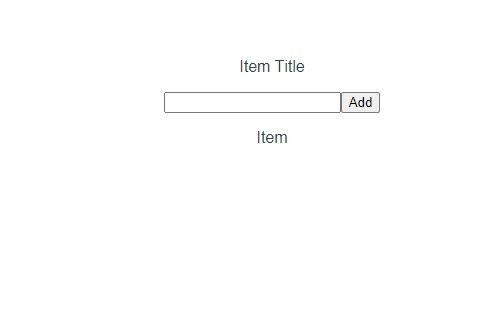

# TodoList Frontend Application

TodoList is frontend application that interact with todo-backend application. Application developed VueJS and used TDD.

## Table of content
- [Pages](#pages)
    - [Todo Item](#todo-item-page)
- [Store](#store)
    - [state](#state)
    - [getters](#getters)
    - [mutations](#mutations)
    - [actions](#actions)
- [Tests](#tests)
    - [Unit](#unit)
    - [Pact](#pack)
      - [Publish](#publish)
- [Deploy](#deploy)
    - [Dockerfile](#dockerfile)
    - [GitLab](#gitlab)
- [Links](#links)

## Pages

### Todo Item
There are three component in the page.
- [ ] A textbox: inputs can entered
- [ ] A button: sends the inputs value to backend application
- [ ] A list: lists items fetched from backend application

### Screenshot:


## Store
### state
``todoItems``: holds todo items 
### getters
``getTodoItems``: gets todo items
### mutations
``setTodoItems``: set todo items from parameter
### actions
``fetchTodoItems``:fetches foto items using axios and pass setTodoItems function.

``createItem``: sends item to create resource to backend application using axios and calls fetchTodoItems function.

## Tests

Two different tests were written as Unit and Pact.

### Unit
Unit tests were written with Jest. Unit tests were placed at ``__tests__`` folders. 

#### TodoItemPage
- [ ] should exists
- [ ] Todo Items list correctly
- [ ] should Add item button clickable
- [ ] should addItem method functionality
#### ToDoItem
- [ ] should render correctly
#### Store
##### actions
- [ ] fetchTodoItems
- [ ] createTodoItems

### Pact
Created consumer pact file to will verify.``Pact`` test file was stored at ``src/tests/unit/pacts``.
There are two endpoint consume from components.

* fetch to-do-items: Get request fetches ``todo item list`` from backend application. 
* create todo list item: Post request creates resource in backend application. Gets a item name and sends to backend application.

#### Publish
Publish.js is a helper javascript file. It publishes created ``pact`` file`to pact broker. It is stored under pact folder.

## Deploy
Project stored at GitLab and deploy steps were created using GitLab pipeline. Project are deployed on kubernetes provided by
`Google Cloud Platform`. Kubernetes configuration files are stored at `deployment-*-env`.

A argument named `BUILD_DIR_ARG` was declared at docker container to determine which environment the project will run on.
This parameter can be change from deployment configuration.

This parameter set at kubernetes deployment configuration.

Addresses of applications:<br>
Test environment : [http://34.75.50.180](http://34.75.50.180) <br>
Production environment: [http://34.138.165.100](http://34.138.165.100)

Note : Reason why Google Cloud Platform choose is $300 free credit.

### Dockerfile
Dockerfile was created to deploy applications to kubernetes. Dockerfile consist of application execute file and config files.

```
FROM nginx:stable-alpine  # base image

ARG BUILD_DIR_ARG=dist          # default built folder
ENV BUILD_DIR=${BUILD_DIR_ARG}  # change built application folder (if specified)

COPY ./${BUILD_DIR} /usr/share/nginx/html   # copy built vue application folder to under nginx to serve

CMD ["nginx", "-g", "daemon off;"]  # runs nginx
```

<br>
BUILD_DIR_ARG variable usage:

```
  docker build -t <image name> . --build-arg BUILD_DIR_ARG="production"
```

Note : if variable BUILD_DIR_ARG didn't specify in command, variable set default value is ``dist``


### GitLab
A pipeline declared on GitLab with ``.gitlab-ci.yml`` file. Stages on pipeline described above.
<br>

- [ ] build-test : application builds as test and stores in folder ``dist``
- [ ] test : runs unit and pact tests. After pact test done, pact file publishes to broker 
- [ ] dockerize-test : creates an image from Dockerfile and push gitLab repository
- [ ] deploy2TestEnv : pushes kubernetes test environment configuration files to Google Cloud Platform to kubernetes
  pull images stored gitLab repository
- [ ] acceptance-tests : Trigger acceptance project job to do acceptance tests
- [ ] build-production : pushes kubernetes production environment configuration files to Google Cloud Platform to kubernetes
  pull images stored gitLab repository
- [ ] dockerize-production : creates an image with production BUILD_DIR_ARG argument from Dockerfile and push gitLab repository 
- [ ] deploy2ProdEnv : pushes kubernetes production environment configuration files to Google Cloud Platform to kubernetes
  pull images stored gitLab repository

## Links

* [Jest](https://jestjs.io/)
* [Pact JS](https://github.com/pact-foundation/pact-js)
